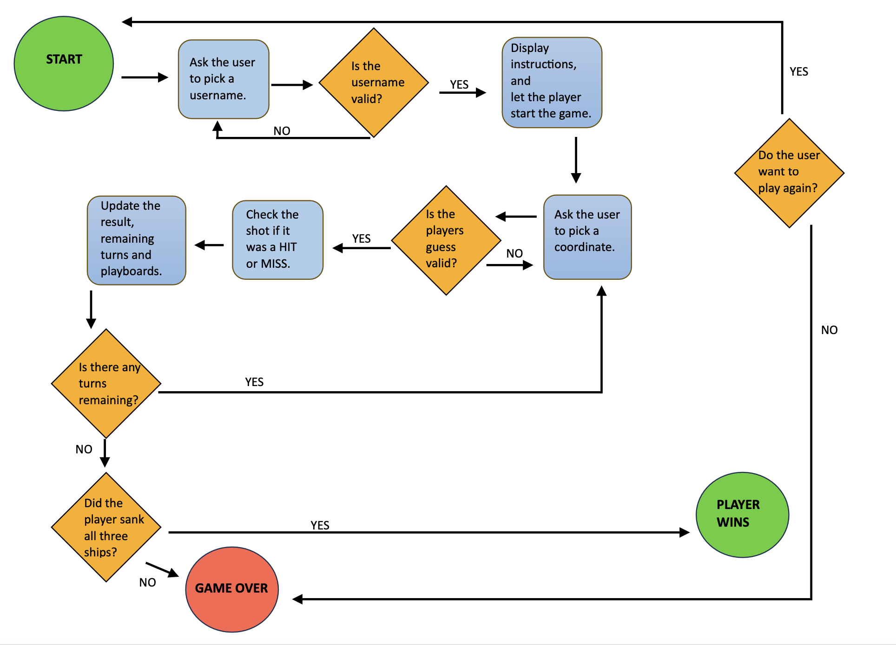

# The Battleship Game

The battleship game is a Python terminal game. 

It is a game between a user and the computer, where the players is trying to beat the other in a game of battleship, by sinking all of the three ships in the opponents playboard. 

The players have 20 turns each, and makes their shots by guessing different coordinates. 

The game is runned in the Code Institutes mock terminal on Heroku.

The live link can be found here: [The Battleship Game](https://battleshipgame-tilde-c1544b267fc4.herokuapp.com/).

## How to play

The game consists of two boards, one of each player. 
The gameboards is marked with the numbers 0 - 4, both by row and column, as a tool to help the player shoot their shot. 

On the players board you can see the ships as '@', and if one of the opponents hits a ship,
the coordinate will be marked as a 'X', if they miss, the coordinate will be marked as a '*'.

Each player have 20 turns to hit all three ships. 
If the player wants to quit the game, thats also possible. 

## Site Owner Goals 

- To provide the user with a fun and simple game. 
- To provide the user with a well functioned game thats easy to navigate through.
- To let the user play again or have a rematch.

## User Stories

- ### As a first time user, I want to:

  - As a first time user I want to easily understand the instructions of the game.
  - As a first time user I want to be able to play a easy and fun game.
  - As a first time user I want to see both my score and the computers score. 
  - As a first time user I want to be able to quit the game.
  - As a first time user I want to be able to play again, when the game is over. 

## Flowchart 

To easily understand the logic and foundation of the game, I created this flowchart to use as a wireframe.

It helped me plan my project and especially when it came to validating the user input. 

The logic of the flowchart helped me figure out what kind of functions I wanted to create and how the different functions would interact with eachother.

The flowchart was created before I started with the projects, so it might not be exactly what I aimed for, but it's an easy tool to understand the buildup of the game.

## Features

#### Username Input & Instructions 

- Welcome message & asking the player to pick a username
- Instructions of the game:
  - How to play
  - How the player can see if they hit their shot.
  - How the player can see if they missed their shot.
  - How the player can see their own ships displayed at their board.
  - How to player can quit the game.
  - How many turns the opponents have to sink all ships.

#### Random Board Generation

- Three ships are randomly placed on both boards.
- The players own ships is showed as '@'.
- The player can't see the ships at the computers board.

#### The game 

- The player is being asked to pick a row (0-4) and a column (0-4) to make their shot.
- When the player makes their shots by guessing coordinates, the coordination must be a valid input, otherwise an error message shows up. 

- A message telling the score board will be showed. 

- If one of the opponents hits a ship a 'X' will be showed.
- If one of the opponents miss the ship a 'O' will be showed. 
- A message displaying how many turns the opponents have left is showed and updated after each round.

- Everytime the player is asked to pick a coordinate, the option to quit the game is also showed. 
- The user choose to type 'exit' to quit the game.
- If the user types 'exit', a question will appear, asking the user if they want to exit the game. 
- If the user chooses to answer 'yes' to that question, the game will exit. 
- If the user instead wants to restart the game they can type 'play'.
- If the user doesn't want to restart the game they can press any key to exit the game.

### Future Features

- To let the user pick how many ships they want and how big of a playboard. 
- To let the player decide their size of ships and let them place them out themselfs.
- To create a leadboard.

## Technologies Used
 - Python

## Data Model 

In this game I am using a Board Class as my data model. 

The Board Class includes all of the functions of the game such as the build ups of boardsize, shipsize, ship placements, the guesses of coordinates, if it was a hit or miss, the remaining turns, and all of the other details on how the game is played. 

All of the game, including all the prints being showed for the player is inside the Board Class except for the
option to restart the game, that function is placed outside of the Board Class. 

## Testing 

- The game has been tested through the [PEP8](https://pep8ci.herokuapp.com/#) linter and had no errors. 
- The players inputs have been manually tested on the Code Institute Heroku terminal and is working without any errors:
  - Invalid Username
    - Empty Character
  - Invalid Coordinates
    - A number lower than 0
    - A number higher than 4
    - A letter
    - A word
    - Empty Character

## Bugs and Issues 

No bugs or issues where found in the code. 

### Future Improvements

When the user wants to exit the game, they have to first type 'exit', before answering a control question asking if they really wants to quit the game. If the user then types 'yes', the print 'Exiting the game..' will be showed and logically the game would quit. 

But then another question is showed asking the user to restart the game or quit the game. 
I wished that the last question would just ask the user to restart and not ask them to enter any key to quit the game, but when I tried to fix that bug I just ran into more bugs. So I decided to keep this bug unfixed and see it as a future feature instead. 

## Deployment

This project was deployed using the Code Institute ,mock terminal for Heroku and the live link can be found here [The Battleship Game](https://battleshipgame-tilde-c1544b267fc4.herokuapp.com/).

This steps were taken for the deployment:

- Create an account or log in to Heroku.
- On the dashboard, in the right corner click the button that says "New" and choose "Create New App".
- Pick a name of the app. The name has to be unique because it can't match any other name being used.
- Select your region, United States or Europe. 
- "Create App".
- On the menu at the top of the page, go to the Settings Tab.
- Scroll down to Config Vars and click "Reveal Config Vars".
- Add a new Config Var and enter PORT in the keybox and 8000 in the valuebox.
- Under Config Vars you will find Buildpacks. 
- Click "Add Buildpacks".
- Select python.
- Repeat this step but select nodejs. 
- Important to know: The python has to be picked before the nodejs, if it is not you can change the order by click and drag to correct the order. 
- Scroll back to the top of the page, to the menu and go to the Deploy Tab.
- Select GitHub as the deployment method and confirm. 
- Search for you repository name and connect that. 
- Scroll down to the bottom of the page and there you can choose if you want the deploys to be Automatic or Manually. The Manually deployed branches needs redepolying each time the repository is updated. 
- Click "View" to see the live site. 

# Credits

- [Love Sandwiches Project](https://github.com/tildeholmqvist/LoveSandwiches)
- [W3Schools](https://www.w3schools.com/)
- [Python Fiddle](http://pythonfiddle.com/battleships-game-in-python/)
- [Stack Overflow](https://stackoverflow.com/)
- Code Institute lessons and projects.
- My mentor Antonio for his advice and support.
